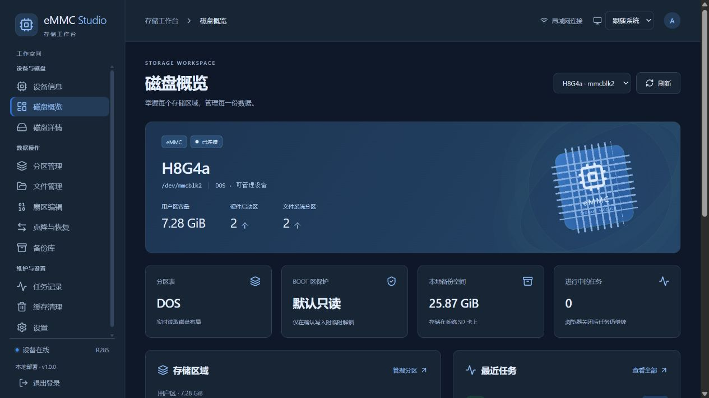

[简体中文](README.md) | [English](README_en.md)

# eMMC Studio

中文局域网 eMMC 磁盘管理工作台，通过浏览器管理 eMMC 用户区、BOOT0/BOOT1、分区和 USB 存储。React + TypeScript + Vite 前端，Flask + Waitress 后端；普通用户提供网页，独立 root 工作进程执行磁盘操作。

默认监听 **0.0.0.0:80**，访问 `http://设备IP/`。支持手机和系统深浅色同步。

从 1.1.0 开始支持串口与 SSH 命令行：`sudo emmc-studio --help`，详见 [CLI 操作教程](docs/CLI.md)。命令行与网页共用磁盘保护和任务记录。



## 功能

| 栏目       | 页面与能力                                                                                      |
| ---------- | ----------------------------------------------------------------------------------------------- |
| 设备与磁盘 | CPU、内存、温度、磁盘和网络仪表盘；磁盘概览；详细标识、CID 厂商、EXT_CSD、寿命区间和速率协议    |
| 数据操作   | GPT/MBR 管理、格式化、ext4 离线扩缩与拖动预览；文件管理；HEX/ASCII 扇区编辑；克隆与恢复；备份库 |
| 维护与设置 | 持久化任务、进度与取消；独立缓存清理；密码和主题设置                                            |

- 系统 SD 卡禁止作为写入、格式化和恢复目标；eMMC 通过 CID 与拓扑识别，不固定使用 `mmcblk2`。
- 用户区与两个 BOOT 区分别展示，各有独立地址空间。BOOT 写操作结束或失败后恢复软件只读保护。
- 范围、区域和完整备份可**直接流式下载到电脑**，不先在 SD 卡暂存镜像；也可保存至 SD/USB。
- 支持 ext4、FAT32、exFAT、NTFS。调整只支持 ext4，不移动分区起点，不调整扩展 MBR 布局。
- 文本编辑最多 2 MiB；字节修改一次最多 64 KiB。全区域按需读取，预览每页 256 B，可跳转指定页码。
- 完整备份含区域镜像、元数据和 SHA-256，恢复前核对容量，恢复后读回校验。
- 密码 8–128 字符，随机盐与 scrypt 单向哈希存储；HttpOnly/SameSite Cookie、CSRF 和登录限速。

## 部署要求

- Debian 12/13、Ubuntu 或兼容 Armbian，使用 systemd 与 apt；建议至少 1 GiB 内存。
- root/sudo 权限，可用的 80 端口，设备能够访问 GitHub 和系统软件源。
- 内核已经识别存储设备；先用 `lsblk` 确认 eMMC、系统盘和 USB。网页不能替代内核驱动。
- 基础工具：curl、ca-certificates、python3。安装方法：

```sh
sudo apt-get update
sudo apt-get install -y curl ca-certificates python3
```

**安装本身不分区、格式化或写入 eMMC。** 网页中的格式化、克隆、恢复和字节保存会覆盖选定区域，提交前请核对目标和范围。

## 方法一：脚本一键部署（推荐）

发布包由 GitHub Actions 构建，设备**不需要 Node.js，不在设备上编译前端**。脚本下载预构建包，核对 SHA-256，检查归档路径，安装依赖与两个开机自启服务。

在设备 SSH 或串口终端执行：

```sh
curl -fL --proto '=https' \
  https://raw.githubusercontent.com/JasonYANG170/eMMC-Studio/main/install.sh \
  -o /tmp/emmc-studio-install.sh
sudo sh /tmp/emmc-studio-install.sh
```

固定安装版本：

```sh
sudo sh /tmp/emmc-studio-install.sh --version v1.0.0
```

只下载和校验，不安装：

```sh
sh /tmp/emmc-studio-install.sh --version v1.0.0 --download-only "$HOME/emmc-studio-package"
```

只检查安装包、系统环境、任务状态与端口：

```sh
sudo sh /tmp/emmc-studio-install.sh --check
```

| 参数                  | 说明                                 |
| --------------------- | ------------------------------------ |
| `--version v1.0.0`    | 安装指定 Release；默认最新正式版本   |
| `--download-only DIR` | 下载校验后的安装包及清单，不修改服务 |
| `--check`             | 下载校验后只做部署前检查             |
| `--help`              | 显示用法                             |

如果 Release 尚未生成安装包，等待 [Actions](https://github.com/JasonYANG170/eMMC-Studio/actions) 完成，或使用源码部署。SHA-256 核对下载完整性，发布源的信任仍来自本仓库与 HTTPS。

## 方法二：手动安装发布包

从 [Releases](https://github.com/JasonYANG170/eMMC-Studio/releases) 下载 `eMMC-Studio.tar.gz` 与 `SHA256SUMS`，复制到设备同一目录：

```sh
sha256sum -c SHA256SUMS
tar -xzf eMMC-Studio.tar.gz
cd eMMC-Studio
sudo sh deploy/install.sh
```

检查环境用 `sudo sh deploy/install.sh --check`。离线且已安装依赖时，可用 `sudo sh deploy/install.sh --skip-apt`；仍会检查 Flask/Waitress 和磁盘工具，缺少依赖时退出。

## 方法三：电脑构建源码，再部署到设备

电脑需要 Git、**Node.js 22.12+**、**Python 3.11+**。Windows/macOS/Linux 均可构建，目标运行环境必须是 Linux。

```sh
git clone https://github.com/JasonYANG170/eMMC-Studio.git
cd eMMC-Studio
npm ci
npm run build
npm run test:frontend
python scripts/package_release.py
```

Windows 可用 `py -3` 替代 `python`。产物是 `release/eMMC-Studio.tar.gz` 和 `release/SHA256SUMS`，不要复制电脑上的 node_modules 或本地运行状态。

```sh
scp release/eMMC-Studio.tar.gz release/SHA256SUMS user@设备IP:/tmp/
ssh user@设备IP
cd /tmp
sha256sum -c SHA256SUMS
tar -xzf eMMC-Studio.tar.gz
cd eMMC-Studio
sudo sh deploy/install.sh
```

也可直接复制构建后的 `backend/`、`dist/`、`deploy/`、`README.md`、`VERSION`，再执行安装脚本。仅下载源码尚未构建时缺少 dist，不能直接安装。

## 首次登录

1. 安装终端显示**一次性管理员设置码**，保存本次输出，不要公开。
2. 用 `hostname -I` 查看设备地址，浏览器打开 `http://设备IP/`。
3. 输入设置码，创建 8–128 字符管理员密码，默认用户名 `emmc-admin`。
4. 登录后在“磁盘详情”核对型号、容量、CID、系统保护及 BOOT 状态。

没有内置默认密码。设置码只存摘要，初始化后失效。更新保留现有管理员。HTTP 80 适用于可信局域网；跨不可信网络请用 HTTPS 反向代理或 VPN。

## 更新与维护

### 更新

重新执行一键脚本，或安装新发布包。管理员、备份、快照和任务记录保留；有等待或运行任务时拒绝更新，等任务结束后重试。

安装器先暂存新程序，停止接收任务并复查，然后替换程序和启动服务。失败时尝试恢复旧程序与原服务。成功后旧程序保留在 `/opt/emmc-studio.previous.<时间>.<进程号>`，可由管理员确认后清理；这个副本不包含 `/var/lib` 的状态数据。

### 路径与日志

| 路径                            | 内容                                 |
| ------------------------------- | ------------------------------------ |
| `/opt/emmc-studio/backend`      | Python 服务源码                      |
| `/opt/emmc-studio/dist`         | 构建后的网页                         |
| `/opt/emmc-studio/deploy`       | 安装、检查、初始化、卸载脚本         |
| `/var/lib/emmc-web`             | 管理员哈希、会话密钥、上传及历史导出 |
| `/var/lib/emmc-worker`          | 备份、快照和 SQLite 任务记录         |
| `/run/emmc-worker/control.sock` | 受限工作进程接口                     |

```sh
systemctl status emmc-worker emmc-web --no-pager
journalctl -u emmc-worker -u emmc-web -n 100 --no-pager
sudo systemctl restart emmc-worker emmc-web
```

手动重启前也应等待任务结束。重启标记未完成任务中断，不自动继续写入。“缓存清理”不删除正式备份或账号；删除快照会失去对应回退副本。

### 卸载

```sh
sudo sh /opt/emmc-studio/deploy/uninstall.sh
```

停止并移除 systemd 服务，**保留程序、管理员和所有备份数据**。永久删除数据需要管理员另行处理。

## 常见问题

- **网页打不开：** 检查设备 IP、网络、防火墙 TCP 80 和服务日志。若 80 被 nginx/Apache 等占用，安装器会拒绝继续。
- **找不到 eMMC：** 检查 lsblk、dmesg 和 MMC 驱动。本项目不提供 USB Gadget 多磁盘导出，不修改 OTG。
- **BOOT 无法打开文件编辑：** BOOT0/BOOT1 通常无常规文件系统，使用扇区编辑。硬件永久保护不能由软件关闭，工具不提供永久配置操作。
- **偏移 3 MiB、长度 4 MiB 超范围：** 长度是从偏移起计算；4 MiB 区域从 3 MiB 开始只剩 1 MiB。读取整个区域用偏移 0、长度 4 MiB 或“整个区域”。
- **寿命 0x01：** A/B 表示预计已消耗 0–10%；PRE_EOL 0x01 表示备用块消耗 <80%。这是区间，不是精确剩余寿命，也不能据此确认 NAND 裸晶型号或 MLC/TLC。
- **没有下载：** 用 Chrome/Edge/Firefox；部分嵌入式浏览器取消附件下载。流式下载断线需要重新发起，不支持断点续传。
- **忘记密码：** root 终端将 `/var/lib/emmc-web/auth.json` 移到安全备份位置，重新运行安装器生成一次性设置码。不要公开密码文件或会话密钥，原备份和任务记录保留。

## 开发与测试

本地预览使用 `npm run dev`。可将 `.env.example` 复制为 `.env.local`，设置 `EMMC_DEV_API` 指向自己的后端；默认代理到 `http://127.0.0.1:80`。开发代理连接真实后端时，网页操作仍会作用于该后端管理的磁盘。

```text
src/                  React 页面、主题、区域图与字节编辑器
public/               图标和主题初始化
backend/              Web API、工作进程、策略与流式传输
deploy/               systemd、本地安装、初始化、检查和卸载
scripts/              前端测试与发布打包
tests/                策略、认证、缓存、临时 loop 与流式测试
docs/                 架构、验证范围、发布说明和截图
.github/workflows/    CI 构建验证与 Release
install.sh            一键安装入口
```

```sh
npm run build
npm run test:frontend
python tests/test_core.py
python tests/test_deploy.py
npm run format
python -m pip install -r requirements-dev.txt
python -m black backend deploy scripts tests
```

Linux 安装开发依赖后，可分别执行 `test_auth_linux.py`、`test_cache_linux.py`、`test_extcsd_lock.py`。以下集成测试需要 root、loop 和挂载支持，仅操作自建临时镜像，不覆盖 MMC：

```sh
sudo python3 tests/integration.py
sudo python3 tests/test_stream_linux.py
```

验证范围见 [docs/VALIDATION.md](docs/VALIDATION.md)，权限与流程见 [docs/ARCHITECTURE.md](docs/ARCHITECTURE.md)。发布时更新 VERSION，推送对应 `v版本号` 标签；Actions 验证通过后生成安装包与 SHA-256 清单。
